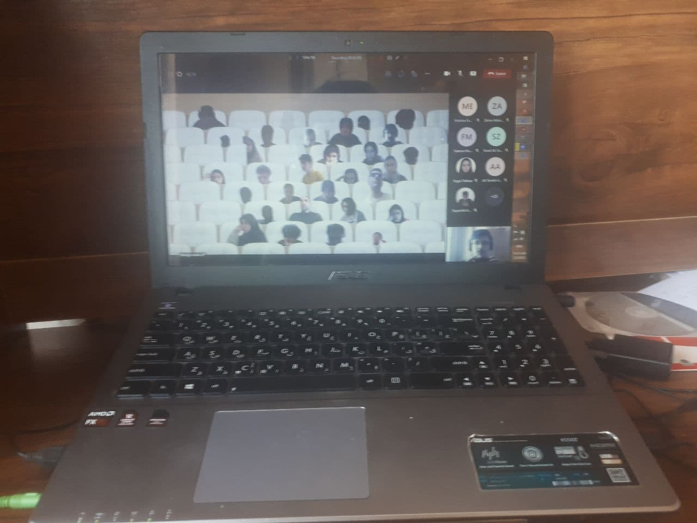

## These are 3 of my best and worst experiences during this semester 

Let's start with a good one; the greatest thing that happened to me was that I found out I really enjoy this programming thing, I absolutely enjoy trying tirelessly to solve hard riddles that I come across.

Let's let it end with a good one too; so the worst experiences I had during these few months was 
the english class I got to be in, the teacher did not have a good and interactive method for teaching and that really hurt me, I love studying English and yet with his method I came to hatred.

Now let's wrap it up with another good one; I met some of the noblest people in my life, some teachers and some fellow students, and this sometimes makes me feel like god wanted me to come in IUST, because I just cannot imagine better people than those I've seen.

---

*End of the Post*